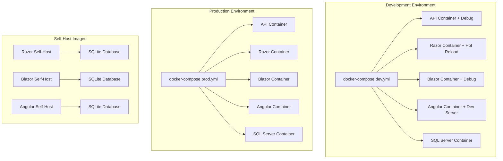

# Full Containerization Design Document

## Overview

This design extends QuokkaPack's existing containerization to provide comprehensive Docker support across all projects, including development/production configurations, Angular project integration, and self-hostable all-in-one images. The solution maintains the clean architecture while enabling flexible deployment scenarios from development to home lab self-hosting.

## Architecture

### Container Architecture Layers



### Project Integration Strategy

The design addresses Angular project integration by:
1. Adding Angular project to the Visual Studio solution
2. Creating MSBuild targets for Node.js dependency management
3. Establishing proper project references to shared libraries
4. Implementing build pipeline integration

## Components and Interfaces

### 1. Individual Project Dockerfiles

#### API Dockerfile (`src/QuokkaPack.API/Dockerfile`)
- **Base Image**: `mcr.microsoft.com/dotnet/aspnet:9.0`
- **Build Strategy**: Multi-stage build with SDK image for compilation
- **Dependencies**: QuokkaPack.Data, QuokkaPack.Shared, QuokkaPack.ServerCommon
- **Optimizations**: Layer caching for NuGet packages, minimal runtime image

#### Razor Dockerfile (`src/QuokkaPack.Razor/Dockerfile`) 
- **Base Image**: `mcr.microsoft.com/dotnet/aspnet:9.0`
- **Build Strategy**: Multi-stage with static asset optimization
- **Dependencies**: QuokkaPack.Shared, QuokkaPack.ServerCommon
- **Features**: Static file serving, development hot reload support

#### Blazor Dockerfile (`src/QuokkaPack.Blazor/Dockerfile`)
- **Base Image**: `mcr.microsoft.com/dotnet/aspnet:9.0`
- **Build Strategy**: Multi-stage with Blazor Server optimization
- **Dependencies**: QuokkaPack.Shared, QuokkaPack.ServerCommon
- **Features**: SignalR support, WebAssembly asset handling

#### Angular Dockerfile (`src/QuokkaPack.Angular/Dockerfile`)
- **Base Image**: `node:18-alpine` (build), `nginx:alpine` (runtime)
- **Build Strategy**: Multi-stage with Node.js build and nginx serving
- **Dependencies**: Built Angular assets, nginx configuration
- **Features**: Production build optimization, nginx reverse proxy

### 2. Docker Compose Configurations

#### Development Configuration (`docker-compose.dev.yml`)
```yaml
# Key features:
- Volume mounts for source code hot reload
- Debug port exposure
- Development database with seed data
- Environment-specific configurations
- Health checks with relaxed timeouts
```

#### Production Configuration (`docker-compose.prod.yml`)
```yaml
# Key features:
- Optimized images without development tools
- Resource limits and constraints
- Production database with persistence
- Health checks with strict timeouts
- Logging and monitoring integration
```

### 3. Self-Host All-in-One Images

#### Architecture Pattern
Each self-host image follows this pattern:
- **Base Layer**: .NET 9.0 runtime with SQLite support
- **API Layer**: QuokkaPack.API with SQLite connection strings
- **Frontend Layer**: Respective frontend (Razor/Blazor/Angular)
- **Database Layer**: SQLite with automatic migration and seeding
- **Reverse Proxy**: nginx for routing and static file serving

#### Image Specifications

**Razor Self-Host** (`Dockerfile.selfhost.razor`)
- Single container with API + Razor frontend
- SQLite database with automatic initialization
- nginx reverse proxy for API routing
- Volume mount for data persistence

**Blazor Self-Host** (`Dockerfile.selfhost.blazor`)
- Single container with API + Blazor Server
- SQLite database with automatic initialization
- SignalR hub configuration
- Volume mount for data persistence

**Angular Self-Host** (`Dockerfile.selfhost.angular`)
- Single container with API + Angular SPA
- SQLite database with automatic initialization
- nginx serving Angular assets and API proxy
- Volume mount for data persistence

## Data Models

### Container Configuration Models

#### Environment Configuration
```yaml
# Development Environment Variables
ASPNETCORE_ENVIRONMENT: Development
ConnectionStrings__DefaultConnection: [SQL Server]
JwtSettings__Secret: [Development Secret]
Logging__LogLevel__Default: Debug

# Production Environment Variables
ASPNETCORE_ENVIRONMENT: Production
ConnectionStrings__DefaultConnection: [SQL Server Production]
JwtSettings__Secret: [Production Secret]
Logging__LogLevel__Default: Information

# Self-Host Environment Variables
ASPNETCORE_ENVIRONMENT: Production
ConnectionStrings__DefaultConnection: [SQLite]
JwtSettings__Secret: [Generated Secret]
SelfHost__DataPath: /app/data
```

#### Volume Mappings
```yaml
# Development Volumes
- ./src:/app/src:ro                    # Source code hot reload
- ./data/dev:/app/data                 # Development data
- sql_dev_data:/var/opt/mssql         # SQL Server data

# Production Volumes
- sql_prod_data:/var/opt/mssql        # SQL Server data
- app_logs:/app/logs                  # Application logs

# Self-Host Volumes
- ./quokkapack-data:/app/data         # SQLite and user data
```

### Angular Project Integration Model

#### Solution Integration
```xml
<!-- QuokkaPack.sln additions -->
<Project Include="src\QuokkaPack.Angular\QuokkaPack.Angular.esproj" />
```

#### MSBuild Integration
```xml
<!-- QuokkaPack.Angular.esproj -->
<Project Sdk="Microsoft.VisualStudio.JavaScript.Sdk">
  <PropertyGroup>
    <StartupCommand>npm start</StartupCommand>
    <BuildCommand>npm run build</BuildCommand>
  </PropertyGroup>
  <ItemGroup>
    <ProjectReference Include="..\QuokkaPack.Shared\QuokkaPack.Shared.csproj" />
    <ProjectReference Include="..\QuokkaPack.Data\QuokkaPack.Data.csproj" />
  </ItemGroup>
  <Target Name="GenerateTypeScriptTypes" BeforeTargets="Build">
    <Exec Command="dotnet run --project ../QuokkaPack.TypeGen -- --output src/types.gen.ts" />
  </Target>
</Project>
```

#### TypeScript Type Generation
```typescript
// Generated types.gen.ts structure
export interface Trip {
  id: string;
  name: string;
  startDate: Date;
  endDate: Date;
  categories: Category[];
}

export interface Category {
  id: string;
  name: string;
  items: Item[];
}

// api-types.ts imports
import { Trip, Category, Item } from './types.gen.ts';
```

## Error Handling

### Container Health Checks

#### API Health Check
```dockerfile
HEALTHCHECK --interval=30s --timeout=10s --start-period=60s --retries=3 \
  CMD curl -f http://localhost:8080/health || exit 1
```

#### Database Health Check
```yaml
healthcheck:
  test: ["CMD-SHELL", "/opt/mssql-tools/bin/sqlcmd -S localhost -U sa -P $$SA_PASSWORD -Q 'SELECT 1'"]
  interval: 30s
  timeout: 10s
  retries: 5
  start_period: 60s
```

#### Frontend Health Checks
```dockerfile
# Razor/Blazor
HEALTHCHECK --interval=30s --timeout=10s --retries=3 \
  CMD curl -f http://localhost:8080/ || exit 1

# Angular
HEALTHCHECK --interval=30s --timeout=10s --retries=3 \
  CMD curl -f http://localhost:80/ || exit 1
```

### Error Recovery Strategies

#### Container Restart Policies
```yaml
restart: unless-stopped
deploy:
  restart_policy:
    condition: on-failure
    delay: 5s
    max_attempts: 3
    window: 120s
```

#### Database Migration Handling
```csharp
// Startup migration with retry logic
public static async Task EnsureDatabaseAsync(IServiceProvider services)
{
    var retryCount = 0;
    const int maxRetries = 5;
    
    while (retryCount < maxRetries)
    {
        try
        {
            using var scope = services.CreateScope();
            var context = scope.ServiceProvider.GetRequiredService<QuokkaPackDbContext>();
            await context.Database.MigrateAsync();
            return;
        }
        catch (Exception ex) when (retryCount < maxRetries - 1)
        {
            retryCount++;
            await Task.Delay(TimeSpan.FromSeconds(Math.Pow(2, retryCount)));
        }
    }
}
```

## Testing Strategy

### Container Testing Approach

#### 1. Build Verification Tests
- Verify all Dockerfiles build successfully
- Validate image sizes are within acceptable limits
- Ensure all required dependencies are included
- Test multi-stage build optimization

#### 2. Integration Testing
```yaml
# docker-compose.test.yml
services:
  api-test:
    build: ./src/QuokkaPack.API
    environment:
      - ASPNETCORE_ENVIRONMENT=Testing
    depends_on:
      - test-db
  
  test-db:
    image: mcr.microsoft.com/mssql/server:2022-latest
    environment:
      - SA_PASSWORD=TestPassword123!
      - ACCEPT_EULA=Y
```

#### 3. Self-Host Image Testing
- Verify single-container deployment works
- Test automatic database initialization
- Validate data persistence across container restarts
- Ensure all frontend routes work correctly

#### 4. Performance Testing
- Container startup time benchmarks
- Memory usage profiling
- Network latency between services
- Database connection pooling efficiency

### Automated Testing Pipeline

#### GitHub Actions Integration
```yaml
name: Container Tests
on: [push, pull_request]
jobs:
  build-test:
    runs-on: ubuntu-latest
    steps:
      - uses: actions/checkout@v4
      - name: Build all images
        run: |
          docker build -f src/QuokkaPack.API/Dockerfile .
          docker build -f src/QuokkaPack.Razor/Dockerfile .
          docker build -f src/QuokkaPack.Blazor/Dockerfile .
          docker build -f src/QuokkaPack.Angular/Dockerfile .
      - name: Test self-host images
        run: |
          docker build -f Dockerfile.selfhost.razor .
          docker build -f Dockerfile.selfhost.blazor .
          docker build -f Dockerfile.selfhost.angular .
```

### Manual Testing Procedures

#### Development Environment Testing
1. Start development environment: `docker-compose -f docker-compose.dev.yml up`
2. Verify hot reload functionality
3. Test API endpoints through Swagger
4. Validate frontend functionality
5. Check database connectivity and migrations

#### Production Environment Testing
1. Build production images: `docker-compose -f docker-compose.prod.yml build`
2. Start production environment: `docker-compose -f docker-compose.prod.yml up -d`
3. Run health checks: `docker-compose -f docker-compose.prod.yml ps`
4. Test application functionality
5. Verify logging and monitoring

#### Self-Host Testing
1. Build self-host image: `docker build -f Dockerfile.selfhost.razor -t quokkapack-selfhost .`
2. Run container: `docker run -p 8080:80 -v ./data:/app/data quokkapack-selfhost`
3. Verify application accessibility
4. Test data persistence
5. Validate automatic database setup