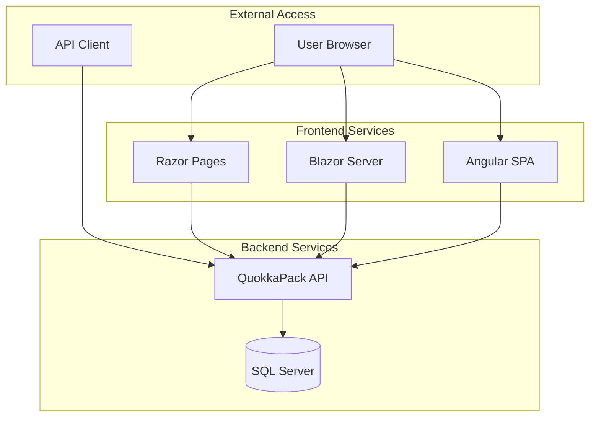

# QuokkaPack Container Deployment Guide

This comprehensive guide covers all aspects of deploying and managing QuokkaPack using Docker containers, from development to production environments.

## Table of Contents

- [Quick Start](#quick-start)
- [Container Architecture](#container-architecture)
- [Development Environment](#development-environment)
- [Production Environment](#production-environment)
- [Self-Host Deployment](#self-host-deployment)
- [Management Scripts](#management-scripts)
- [Troubleshooting](#troubleshooting)
- [Performance Optimization](#performance-optimization)
- [Security Considerations](#security-considerations)
- [Monitoring and Logging](#monitoring-and-logging)

## Quick Start

### Prerequisites

- **Docker Desktop** 4.0+ with Docker Compose V2
- **PowerShell** 7.0+ (for management scripts)
- **Git** (for source code)
- **4GB RAM** minimum, 8GB recommended
- **10GB disk space** for images and data

### Development Quick Start

```powershell
# Clone and navigate to project
git clone <repository-url>
cd QuokkaPack

# Start development environment
.\scripts\start-dev.ps1

# Access applications
# API: http://localhost:5000/swagger
# Razor: http://localhost:5001
# Blazor: http://localhost:5002
# Angular: http://localhost:4200
```

### Production Quick Start

```powershell
# Build production images
.\scripts\build-all-images.ps1 -Environment prod

# Start production environment
.\scripts\start-prod.ps1

# Access applications (HTTPS)
# API: https://localhost:5443/swagger
# Razor: https://localhost:5444
# Blazor: https://localhost:5445
# Angular: https://localhost:5446
```

## Container Architecture

### Service Overview

QuokkaPack consists of the following containerized services:

| Service | Purpose | Base Image | Ports |
|---------|---------|------------|-------|
| **API** | REST API with Swagger | .NET 9.0 ASP.NET Core | 5000/5443 |
| **Razor** | Primary web frontend | .NET 9.0 ASP.NET Core | 5001/5444 |
| **Blazor** | Alternative web frontend | .NET 9.0 ASP.NET Core | 5002/5445 |
| **Angular** | SPA frontend | Node.js + nginx | 4200/5446 |
| **SQL Server** | Database | SQL Server 2022 | 1433/1434 |

### Network Architecture



### Volume Strategy

#### Development Volumes
- **Source Code**: Hot reload via bind mounts
- **Database**: Named volume for persistence
- **Node Modules**: Anonymous volume for performance

#### Production Volumes
- **Database**: Named volume with backup strategy
- **Logs**: Named volume for centralized logging
- **SSL Certificates**: Bind mount for certificate management

## Development Environment

### Configuration Files

#### docker-compose.dev.yml
The development configuration includes:
- Volume mounts for hot reload
- Debug port exposure
- Development database with seed data
- Relaxed health checks
- Environment-specific variables

#### Environment Variables (.env.dev)
```env
# Database
SA_PASSWORD=YourStrong@Passw0rd
ACCEPT_EULA=Y

# Application
ASPNETCORE_ENVIRONMENT=Development
ConnectionStrings__DefaultConnection=Server=sqlserver;Database=QuokkaPack;User Id=sa;Password=YourStrong@Passw0rd;TrustServerCertificate=true;

# JWT
JwtSettings__Secret=your-super-secret-jwt-key-for-development-only
JwtSettings__Issuer=QuokkaPack
JwtSettings__Audience=QuokkaPack

# Logging
Logging__LogLevel__Default=Debug
Logging__LogLevel__Microsoft.AspNetCore=Warning
```

### Development Workflow

1. **Start Environment**
   ```powershell
   .\scripts\start-dev.ps1
   ```

2. **Make Code Changes**
   - Changes are automatically reflected via volume mounts
   - No container restart required for most changes

3. **Database Changes**
   ```powershell
   # Add migration
   dotnet ef migrations add NewMigration --project src/QuokkaPack.Data --startup-project src/QuokkaPack.API
   
   # Apply to running container
   docker-compose -f docker-compose.dev.yml exec api dotnet ef database update
   ```

4. **View Logs**
   ```powershell
   .\scripts\start-dev.ps1 -Logs
   ```

5. **Stop Environment**
   ```powershell
   .\scripts\stop-dev.ps1
   ```

### Development Features

- **Hot Reload**: Source code changes reflected immediately
- **Debug Ports**: Exposed for IDE debugging
- **Seed Data**: Automatic database seeding with test data
- **Swagger UI**: Available at http://localhost:5000/swagger
- **SQL Server Management**: Accessible via SSMS on localhost:1433

## Production Environment

### Configuration Files

#### docker-compose.prod.yml
The production configuration includes:
- Optimized images without development tools
- Resource limits and constraints
- Production database with persistence
- Strict health checks
- Security hardening

#### Environment Variables (.env.prod)
```env
# Database
SA_PASSWORD=YourProductionPassword123!
ACCEPT_EULA=Y

# Application
ASPNETCORE_ENVIRONMENT=Production
ConnectionStrings__DefaultConnection=Server=sqlserver;Database=QuokkaPack;User Id=sa;Password=YourProductionPassword123!;TrustServerCertificate=true;

# JWT
JwtSettings__Secret=your-production-jwt-secret-key-minimum-32-characters
JwtSettings__Issuer=QuokkaPack
JwtSettings__Audience=QuokkaPack

# Logging
Logging__LogLevel__Default=Information
Logging__LogLevel__Microsoft.AspNetCore=Warning

# Security
ASPNETCORE_URLS=https://+:443;http://+:80
ASPNETCORE_Kestrel__Certificates__Default__Password=YourCertPassword
ASPNETCORE_Kestrel__Certificates__Default__Path=/app/certificates/aspnetapp.pfx
```

### Production Deployment Steps

1. **Prepare Environment**
   ```powershell
   # Create production environment file
   cp .env.prod.template .env.prod
   # Edit .env.prod with production values
   ```

2. **Build Production Images**
   ```powershell
   .\scripts\build-all-images.ps1 -Environment prod
   ```

3. **Deploy Services**
   ```powershell
   .\scripts\start-prod.ps1
   ```

4. **Verify Deployment**
   ```powershell
   # Check service health
   docker-compose -f docker-compose.prod.yml ps
   
   # Test endpoints
   curl -k https://localhost:5443/health
   ```

### Production Features

- **HTTPS Only**: SSL/TLS encryption for all services
- **Health Checks**: Comprehensive monitoring
- **Resource Limits**: CPU and memory constraints
- **Restart Policies**: Automatic recovery from failures
- **Logging**: Structured logging to files and stdout

## Self-Host Deployment

Self-host images provide all-in-one containers perfect for home labs and small deployments.

### Available Self-Host Images

1. **Razor Self-Host** (`quokkapack-selfhost-razor`)
   - API + Razor Pages + SQLite
   - Single container deployment
   - nginx reverse proxy

2. **Blazor Self-Host** (`quokkapack-selfhost-blazor`)
   - API + Blazor Server + SQLite
   - SignalR support included
   - Single container deployment

3. **Angular Self-Host** (`quokkapack-selfhost-angular`)
   - API + Angular SPA + SQLite
   - nginx serving static files
   - Single container deployment

### Self-Host Deployment

#### Build Self-Host Images
```powershell
.\scripts\build-all-images.ps1 -ImageType selfhost
```

#### Deploy Razor Self-Host
```powershell
# Run with data persistence
docker run -d \
  --name quokkapack-razor \
  -p 8080:80 \
  -v quokkapack-data:/app/data \
  -e ASPNETCORE_ENVIRONMENT=Production \
  quokkapack-selfhost-razor:latest

# Access application
# http://localhost:8080
```

#### Deploy with Docker Compose
```yaml
# docker-compose.selfhost.yml
version: '3.8'
services:
  quokkapack:
    image: quokkapack-selfhost-razor:latest
    ports:
      - "8080:80"
    volumes:
      - quokkapack-data:/app/data
    environment:
      - ASPNETCORE_ENVIRONMENT=Production
      - SelfHost__DataPath=/app/data
    restart: unless-stopped

volumes:
  quokkapack-data:
```

### Self-Host Configuration

#### Environment Variables
```env
# Required
ASPNETCORE_ENVIRONMENT=Production
SelfHost__DataPath=/app/data

# Optional
JwtSettings__Secret=auto-generated-if-not-provided
Logging__LogLevel__Default=Information
SelfHost__EnableSwagger=false
```

#### Data Persistence
- **SQLite Database**: `/app/data/quokkapack.db`
- **User Uploads**: `/app/data/uploads`
- **Logs**: `/app/data/logs`

## Management Scripts

### Build Scripts

#### build-all-images.ps1
Builds all Docker images with various options:

```powershell
# Build all images
.\scripts\build-all-images.ps1

# Build only individual project images for development
.\scripts\build-all-images.ps1 -ImageType individual -Environment dev

# Build self-host images without cache
.\scripts\build-all-images.ps1 -ImageType selfhost -NoCache

# Build production images only
.\scripts\build-all-images.ps1 -Environment prod
```

**Parameters:**
- `-ImageType`: `all`, `individual`, `selfhost`
- `-Environment`: `dev`, `prod`, `both`
- `-NoCache`: Force rebuild without cache

### Environment Management Scripts

#### start-dev.ps1
Starts the development environment:

```powershell
# Start all services
.\scripts\start-dev.ps1

# Start with rebuild
.\scripts\start-dev.ps1 -Build

# Start in background
.\scripts\start-dev.ps1 -Detached

# Start specific services
.\scripts\start-dev.ps1 -Services "api,razor,sqlserver"

# View logs
.\scripts\start-dev.ps1 -Logs
```

#### start-prod.ps1
Starts the production environment:

```powershell
# Start production environment
.\scripts\start-prod.ps1

# Start with scaling
.\scripts\start-prod.ps1 -Scale "api=2,razor=2"

# Start specific services
.\scripts\start-prod.ps1 -Services "api,sqlserver"
```

#### stop-dev.ps1 / stop-prod.ps1
Stops environments with various cleanup options:

```powershell
# Stop services
.\scripts\stop-dev.ps1

# Stop and remove containers
.\scripts\stop-dev.ps1 -Remove

# Complete cleanup (WARNING: Deletes data)
.\scripts\stop-dev.ps1 -All

# Stop specific services
.\scripts\stop-dev.ps1 -Services "api,razor"
```

### Cleanup Scripts

#### cleanup-containers.ps1
Comprehensive cleanup utility:

```powershell
# Clean up stopped containers
.\scripts\cleanup-containers.ps1

# Clean up images
.\scripts\cleanup-containers.ps1 -Type images

# Dry run to see what would be cleaned
.\scripts\cleanup-containers.ps1 -DryRun

# Complete cleanup
.\scripts\cleanup-containers.ps1 -Type all -Force

# System-wide Docker cleanup
.\scripts\cleanup-containers.ps1 -Type system -Prune
```

## Troubleshooting

### Common Issues

#### 1. Port Already in Use
**Symptoms:**
- Error: "Port 5000 is already allocated"
- Services fail to start

**Solutions:**
```powershell
# Find process using port
netstat -ano | findstr :5000

# Kill process (replace PID)
taskkill /PID <PID> /F

# Use different ports
# Edit docker-compose.yml port mappings
```

#### 2. Database Connection Issues
**Symptoms:**
- API health checks fail
- Database connection timeout errors

**Solutions:**
```powershell
# Check SQL Server container
docker-compose -f docker-compose.dev.yml logs sqlserver

# Verify database is ready
docker-compose -f docker-compose.dev.yml exec sqlserver /opt/mssql-tools/bin/sqlcmd -S localhost -U sa -P YourStrong@Passw0rd -Q "SELECT 1"

# Reset database
.\scripts\stop-dev.ps1 -Volumes
.\scripts\start-dev.ps1 -Build
```

#### 3. Out of Disk Space
**Symptoms:**
- Build failures
- "No space left on device" errors

**Solutions:**
```powershell
# Check Docker disk usage
docker system df

# Clean up unused resources
.\scripts\cleanup-containers.ps1 -Type system -Prune

# Remove unused images
docker image prune -a

# Remove unused volumes (WARNING: Data loss)
docker volume prune
```

#### 4. Memory Issues
**Symptoms:**
- Containers being killed (OOMKilled)
- Slow performance

**Solutions:**
```powershell
# Check container resource usage
docker stats

# Increase Docker Desktop memory limit
# Docker Desktop → Settings → Resources → Memory

# Add memory limits to docker-compose.yml
deploy:
  resources:
    limits:
      memory: 1G
    reservations:
      memory: 512M
```

#### 5. SSL Certificate Issues (Production)
**Symptoms:**
- HTTPS endpoints not accessible
- Certificate validation errors

**Solutions:**
```powershell
# Generate development certificates
dotnet dev-certs https -ep aspnetapp.pfx -p YourCertPassword
dotnet dev-certs https --trust

# Mount certificates in docker-compose.prod.yml
volumes:
  - ./certificates:/app/certificates:ro

# Verify certificate
openssl x509 -in aspnetapp.crt -text -noout
```

### Debugging Techniques

#### Container Logs
```powershell
# View logs for all services
docker-compose -f docker-compose.dev.yml logs

# Follow logs for specific service
docker-compose -f docker-compose.dev.yml logs -f api

# View last 100 lines
docker-compose -f docker-compose.dev.yml logs --tail=100 api
```

#### Container Shell Access
```powershell
# Access running container
docker-compose -f docker-compose.dev.yml exec api bash

# Run one-off container for debugging
docker run -it --rm quokkapack-api:dev bash

# Check container filesystem
docker-compose -f docker-compose.dev.yml exec api ls -la /app
```

#### Network Debugging
```powershell
# List Docker networks
docker network ls

# Inspect network configuration
docker network inspect quokkapack-dev_default

# Test connectivity between containers
docker-compose -f docker-compose.dev.yml exec api ping sqlserver
```

#### Health Check Debugging
```powershell
# Check health status
docker-compose -f docker-compose.dev.yml ps

# View health check logs
docker inspect --format='{{json .State.Health}}' container_name

# Manual health check
docker-compose -f docker-compose.dev.yml exec api curl -f http://localhost:8080/health
```

### Performance Troubleshooting

#### Slow Build Times
```powershell
# Use build cache effectively
.\scripts\build-all-images.ps1

# Parallel builds
docker-compose -f docker-compose.dev.yml build --parallel

# Optimize Dockerfile layers
# Move frequently changing files to end of Dockerfile
```

#### Slow Container Startup
```powershell
# Check resource constraints
docker stats

# Optimize health check intervals
healthcheck:
  interval: 30s
  timeout: 10s
  start_period: 60s

# Use init system for proper signal handling
init: true
```

#### Database Performance
```powershell
# Monitor SQL Server performance
docker-compose -f docker-compose.dev.yml exec sqlserver /opt/mssql-tools/bin/sqlcmd -S localhost -U sa -P YourStrong@Passw0rd -Q "SELECT * FROM sys.dm_exec_requests"

# Increase SQL Server memory
environment:
  - MSSQL_MEMORY_LIMIT_MB=2048
```

## Performance Optimization

### Image Optimization

#### Multi-Stage Builds
All Dockerfiles use multi-stage builds to minimize final image size:

```dockerfile
# Build stage
FROM mcr.microsoft.com/dotnet/sdk:9.0 AS build
WORKDIR /src
COPY ["src/QuokkaPack.API/QuokkaPack.API.csproj", "src/QuokkaPack.API/"]
RUN dotnet restore "src/QuokkaPack.API/QuokkaPack.API.csproj"
COPY . .
RUN dotnet build "src/QuokkaPack.API/QuokkaPack.API.csproj" -c Release -o /app/build

# Publish stage
FROM build AS publish
RUN dotnet publish "src/QuokkaPack.API/QuokkaPack.API.csproj" -c Release -o /app/publish

# Runtime stage
FROM mcr.microsoft.com/dotnet/aspnet:9.0 AS final
WORKDIR /app
COPY --from=publish /app/publish .
ENTRYPOINT ["dotnet", "QuokkaPack.API.dll"]
```

#### Layer Caching
- Dependencies copied and restored before source code
- Frequently changing files placed at end of Dockerfile
- Use `.dockerignore` to exclude unnecessary files

#### Image Size Reduction
```powershell
# Check image sizes
docker images --format "table {{.Repository}}\t{{.Tag}}\t{{.Size}}"

# Use alpine variants where possible
FROM node:18-alpine

# Remove package managers after installation
RUN apt-get update && apt-get install -y package && rm -rf /var/lib/apt/lists/*
```

### Runtime Optimization

#### Resource Limits
```yaml
# docker-compose.prod.yml
services:
  api:
    deploy:
      resources:
        limits:
          cpus: '1.0'
          memory: 1G
        reservations:
          cpus: '0.5'
          memory: 512M
```

#### Health Check Optimization
```yaml
healthcheck:
  test: ["CMD", "curl", "-f", "http://localhost:8080/health"]
  interval: 30s
  timeout: 10s
  retries: 3
  start_period: 60s
```

#### Database Optimization
```yaml
# SQL Server optimization
environment:
  - MSSQL_MEMORY_LIMIT_MB=2048
  - MSSQL_CPU_COUNT=2
volumes:
  - sql_data:/var/opt/mssql/data
  - sql_log:/var/opt/mssql/log
```

## Security Considerations

### Container Security

#### Non-Root User
```dockerfile
# Create non-root user
RUN addgroup --system --gid 1001 nodejs
RUN adduser --system --uid 1001 nextjs
USER nextjs
```

#### Read-Only Root Filesystem
```yaml
services:
  api:
    read_only: true
    tmpfs:
      - /tmp
      - /var/tmp
```

#### Security Scanning
```powershell
# Scan images for vulnerabilities
docker scout cves quokkapack-api:latest

# Use minimal base images
FROM mcr.microsoft.com/dotnet/aspnet:9.0-alpine
```

### Network Security

#### Internal Networks
```yaml
networks:
  frontend:
    driver: bridge
  backend:
    driver: bridge
    internal: true
```

#### Secrets Management
```yaml
secrets:
  db_password:
    file: ./secrets/db_password.txt
  jwt_secret:
    file: ./secrets/jwt_secret.txt

services:
  api:
    secrets:
      - db_password
      - jwt_secret
```

### Production Security Checklist

- [ ] Use HTTPS for all external endpoints
- [ ] Implement proper authentication and authorization
- [ ] Use secrets management for sensitive data
- [ ] Enable container security scanning
- [ ] Implement network segmentation
- [ ] Use read-only root filesystems where possible
- [ ] Run containers as non-root users
- [ ] Keep base images updated
- [ ] Implement proper logging and monitoring
- [ ] Use resource limits to prevent DoS

## Monitoring and Logging

### Health Monitoring

#### Built-in Health Checks
All services include health check endpoints:
- API: `/health`
- Razor: `/health`
- Blazor: `/health`
- Angular: nginx status page

#### External Monitoring
```yaml
# Add monitoring stack
services:
  prometheus:
    image: prom/prometheus
    ports:
      - "9090:9090"
    volumes:
      - ./monitoring/prometheus.yml:/etc/prometheus/prometheus.yml

  grafana:
    image: grafana/grafana
    ports:
      - "3000:3000"
    environment:
      - GF_SECURITY_ADMIN_PASSWORD=admin
```

### Logging Strategy

#### Structured Logging
All .NET services use Serilog for structured logging:

```json
{
  "timestamp": "2024-01-15T10:30:00.000Z",
  "level": "Information",
  "messageTemplate": "HTTP {RequestMethod} {RequestPath} responded {StatusCode}",
  "properties": {
    "RequestMethod": "GET",
    "RequestPath": "/api/trips",
    "StatusCode": 200,
    "RequestId": "0HN7GKBV3N0J1:00000001"
  }
}
```

#### Log Aggregation
```yaml
# Add ELK stack for log aggregation
services:
  elasticsearch:
    image: docker.elastic.co/elasticsearch/elasticsearch:8.11.0
    environment:
      - discovery.type=single-node
      - xpack.security.enabled=false

  logstash:
    image: docker.elastic.co/logstash/logstash:8.11.0
    volumes:
      - ./logging/logstash.conf:/usr/share/logstash/pipeline/logstash.conf

  kibana:
    image: docker.elastic.co/kibana/kibana:8.11.0
    ports:
      - "5601:5601"
```

#### Log Management
```powershell
# View aggregated logs
docker-compose -f docker-compose.prod.yml logs --since=1h

# Export logs
docker-compose -f docker-compose.prod.yml logs --since=24h > logs_$(Get-Date -Format "yyyy-MM-dd").txt

# Rotate logs
docker-compose -f docker-compose.prod.yml logs --since=0 | Out-File -FilePath "logs_archive.txt"
```

### Metrics Collection

#### Application Metrics
- Request count and duration
- Error rates
- Database connection pool status
- Memory and CPU usage

#### Infrastructure Metrics
- Container resource usage
- Network traffic
- Disk I/O
- Database performance

#### Custom Dashboards
Create Grafana dashboards for:
- Application performance overview
- Error tracking and alerting
- Resource utilization trends
- Business metrics (user registrations, trips created)

---

## Support and Resources

### Documentation
- [Docker Documentation](https://docs.docker.com/)
- [Docker Compose Reference](https://docs.docker.com/compose/)
- [.NET Docker Guide](https://docs.microsoft.com/en-us/dotnet/core/docker/)

### Community
- [QuokkaPack GitHub Issues](https://github.com/your-org/quokkapack/issues)
- [Docker Community Forums](https://forums.docker.com/)

### Professional Support
For enterprise deployments and professional support, contact the QuokkaPack team.

---

*Last updated: January 2024*
*Version: 1.0*